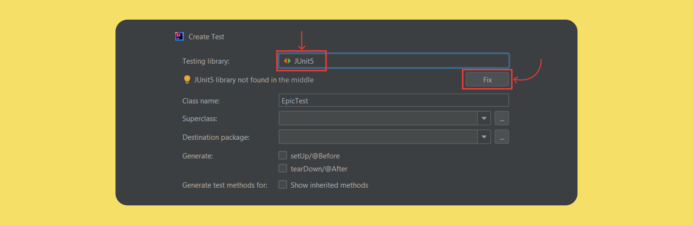
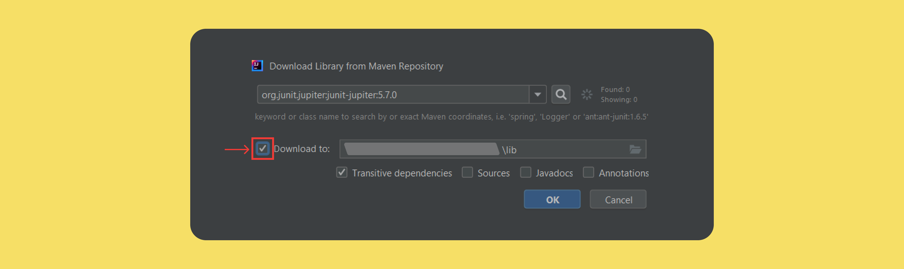

# java-kanban-main
java-kanban-sprint8-hw - последний спринт по Трекеру задач.

### Задание спринта.

#### Трекер задач

Как системы контроля версий помогают команде работать с общим кодом, так и трекеры задач
позволяют эффективно организовать совместную работу над задачами. Вам предстоит написать
бэкенд для такого трекера. В итоге должна получиться программа, отвечающая за формирование
модели данных для этой страницы:

        💡 Пользователь не будет видеть консоль вашего приложения. Поэтому нужно сделать так, чтобы 
           методы не просто печатали что-то в консоль, но и возвращали объекты нужных типов.
           Вы можете добавить консольный вывод для самопроверки в класcе Main, но на работу методов он 
           влиять не должен.

 
 ТЗ 
  

Нужно усовершенствовать приложение "Трекер задач" из ТЗ для 3, 4, 5, 6 ,7 спринта (ветки: java-kanban-sprint3/4/5/6/7
-hw).

 
 Задания 3, 4, 5, 6, 7 cпринта 
 

 
 ТЗ 3-го спринта 
  

Нужно написать приложение "Трекер задач" с консольным управлением.

### Типы задач

1. Task - задачи без подзадач;
2. Epic - задачи с подзадачами;
3. SubTask - задачи входящие в epic.

### Свойства задач

У каждой задачи есть статус, отображающий её прогресс:

1. NEW — задача только создана, но к её выполнению ещё не приступили.
2. IN_PROCESS — над задачей ведётся работа.
3. DONE — задача выполнена.

Для каждой подзадачи известно, в рамках какого эпика она выполняется.   
Каждый эпик знает, какие подзадачи в него входят.   
Завершение всех подзадач эпика считается завершением эпика.

Трекер, через консоль, позволяет добавлять, удалять, обновлять вести учет всех перечисленных
типов задач.

### Идентификатор задачи

У каждого типа задач есть идентификатор. Это целое число, уникальное для всех типов задач.
По нему мы находим,
обновляем, удаляем задачи. При создании задачи менеджер присваивает ей новый идентификатор.
Подсказка: как создавать идентификаторы.

### Менеджер

Кроме классов для описания задач, вам нужно реализовать класс для объекта-менеджера. Он будет запускаться на старте
программы и управлять всеми задачами. В нём должны быть реализованы следующие функции:

1. Возможность хранить задачи всех типов. Для этого вам нужно выбрать подходящую коллекцию.
2. Методы для каждого из типа задач(Задача/Эпик/Подзадача):

* a. Получение списка всех задач.
* b. Удаление всех задач.
* c. Получение по идентификатору.
* d. Создание. Сам объект должен передаваться в качестве параметра.
* e. Обновление. Новая версия объекта с верным идентификатором передаётся в виде параметра.
* f. Удаление по идентификатору.

3. Дополнительные методы:

* a. Получение списка всех подзадач определённого эпика.

4. Управление статусами осуществляется по следующему правилу:

* a. Менеджер сам не выбирает статус для задачи. Информация о нём приходит менеджеру вместе с информацией о самой
  задаче.
  По этим данным в одних случаях он будет сохранять статус, в других будет рассчитывать.

    * b. Для эпиков:

  если у эпика нет подзадач или все они имеют статус NEW, то статус должен быть NEW.
  если все подзадачи имеют статус DONE, то и эпик считается завершённым — со статусом DONE.
  во всех остальных случаях статус должен быть IN_PROGRESS.

### Хранение задач

Итак, вам нужно:

1. Получать задачи по идентификатору
2. Выводить списки задач разных типов

Один из способов организовать такое хранение — это присвоить соответствие между идентификатором и задачей при помощи
HashMap. Поскольку идентификатор не может повторяться (иначе он не был бы идентификатором), такой подход позволит
быстро получать задачу.
Чтобы получать разные типы задач, вы можете создать три HashMap по одной на каждый из видов задач.

### Обновление данных

При обновлении можете считать, что на вход подаётся новый объект, который должен полностью заменить старый. К
примеру, метод для обновления эпика может принимать эпик в качестве входных данных public void updateTask(Task task).
Если вы храните эпики в HashMap, где ключами являются идентификаторы, то обновление — это запись нового эпика
tasks.put(task.getId(), task)).

### Обновление статуса задачи

Фраза «информация приходит вместе с информацией по задаче» означает, что не существует отдельного метода, который
занимался бы только обновлением статуса задачи. Вместо этого статус задачи обновляется вместе с полным обновлением
задачи.

### Обновление эпиков

Из описания задачи видно, что эпик не управляет своим статусом самостоятельно. Это значит:

1. Пользователь не должен иметь возможности поменять статус эпика самостоятельно
2. Когда меняется статус любой подзадачи в эпике, вам необходимо проверить, что статус эпика изменится соответствующим
   образом. При этом изменение статуса эпика может и не произойти, если в нём, к примеру, всё ещё есть незакрытые
   задачи.

 
 ТЗ 4-го спринта 
  

Нужно усовершенствовать приложение "Трекер задач" из ТЗ для третьего спринта (ветка: java-kanban-sprint3-hw).

### Менеджер теперь интерфейс

1. Класс TaskManager должен стать интерфейсом. В нём нужно собрать список методов, которые должны быть у любого
   объекта-менеджера. Вспомогательные методы, если вы их создавали, переносить в интерфейс не нужно.
2. Созданный ранее класс менеджера нужно переименовать в InMemoryTaskManager. Именно то, что менеджер хранит всю
   информацию в оперативной памяти, и есть его главное свойство, позволяющее эффективно управлять задачами. Внутри
   класса должна остаться реализация методов. При этом важно не забыть имплементировать TaskManager, ведь в Java класс
   должен явно заявить, что он подходит под требования интерфейса.

### История просмотров задач

Добавьте в программу новую функциональность — нужно, чтобы трекер отображал последние просмотренные пользователем
задачи. Для этого добавьте метод getHistory() в TaskManager и реализуйте его — он должен возвращать последние 10
просмотренных задач. Просмотром будем считаться вызов у менеджера методов получения задачи по идентификатору —
getTask(), getSubtask() и getEpic(). От повторных просмотров избавляться не нужно.
Пример формирования истории просмотров задач после вызовов методов менеджера:

У метода getHistory() не будет параметров. Это значит, он формирует свой ответ, анализируя исключительно внутреннее
состояние полей объекта менеджера. Подумайте, каким образом и какие данные вы запишете в поля менеджера для возможности
извлекать из них историю посещений. Так как в истории отображается, к каким задачам было обращение в методах getTask(),
getSubtask() и getEpic(), эти данные в полях менеджера будут обновляться при вызове этих трех методов.

Обратите внимание, что просмотрен может быть любой тип задачи. То есть возвращаемый список задач может содержать объект
одного из трех типов на любой своей позиции. Чтобы описать ячейку такого списка, нужно вспомнить о полиморфизме и
выбрать тип, являющийся общим родителем обоих классов.

### Утилитарный класс

Со временем в приложении трекера появится несколько реализаций интерфейса TaskManager. Чтобы не зависеть от реализации,
создайте утилитарный класс Managers. На нём будет лежать вся ответственность за создание менеджера задач. То есть
Managers должен сам подбирать нужную реализацию TaskManagerи возвращать объект правильного типа.

У Managersбудет метод getDefault(). При этом вызывающему неизвестен конкретный класс, только то, что объект, который
возвращает getDefault(), реализует интерфейс TaskManager.

### Статусы задач как перечисление

Так как варианты возможных статусов у задачи ограничены, для их хранения в программе лучше завести перечисляемый тип
enum.

### Тестирование вашего решения

Убедитесь, что ваше решение работает! В главном классе воспроизведите несложный пользовательский сценарий:

* создайте несколько задач разного типа.
* вызовите разные методы интерфейса TaskManager и напечатайте историю просмотров после каждого вызова. Если код рабочий,
  то история просмотров задач будет отображаться корректно.

### Сделайте историю задач интерфейсом

В этом спринте возможности трекера ограничены — в истории просмотров допускается дублирование и она может содержать
только десять задач. В следующем спринте вам нужно будет убрать дубли и расширить её размер. Чтобы подготовиться к
этому, проведите рефакторинг кода.

Создайте отдельный интерфейс для управления историей просмотров — HistoryManager. У него будет два метода. Первый add(
Task task) должен помечать задачи как просмотренные, а второй getHistory() — возвращать их список.
Объявите класс InMemoryHistoryManager и перенесите в него часть кода для работы с историей из класса
InMemoryTaskManager. Новый класс InMemoryHistoryManager должен реализовывать интерфейс HistoryManager.

Добавьте в служебный класс Managers статический метод HistoryManager getDefaultHistory(). Он должен возвращать объект
InMemoryHistoryManager — историю просмотров.

Проверьте, что теперь InMemoryTaskManager обращается к менеджеру истории через интерфейс HistoryManager и использует
реализацию, которую возвращает метод getDefaultHistory().

Ещё раз всё протестируйте!

 
 ТЗ 5-го спринта 
  

В этом спринте вам предстоит поработать с историей просмотров задач, а именно избавиться от повторных просмотров в ней и
ограничения на размер истории.

### Обратите внимание

Недостаточно реализовать код таким образом, чтобы программа пробегалась по всей истории просмотров и только после этого
удаляла предыдущий просмотр. Ведь тогда время работы этой программы будет линейно зависеть от длины истории.
Ваша цель — реализовать функциональность так, чтобы время просмотра задачи никак не зависело от общего количества задач
в истории.

### Интерфейс HistoryManager

У нас уже есть интерфейс, осталось добавить метод void remove(int id) для удаления задачи из просмотра. И реализовать
его в классе InMemoryHistoryManager. Добавьте его вызов при удалении задач, чтобы они также удалялись из истории
просмотров.

### Дальнейшая разработка алгоритма с CustomLinkedList и HashMap

Программа должна запоминать порядок вызовов метода add, ведь именно в этом порядке просмотры будут выстраиваться в
истории. Для хранения порядка вызовов удобно использовать список.

Если какая-либо задача просматривалась несколько раз, в истории должен отобразиться только последний просмотр.
Предыдущий просмотр должен быть удалён сразу же после появления нового — за O(1). Из темы о списках вы узнали, что
константное время выполнения операции может гарантировать связный список LinkedList. Однако эта стандартная реализация в
данном случае не подойдёт. Поэтому вам предстоит написать собственную.

CustomLinkedList позволяет удалить элемент из произвольного места за О(1) с одним важным условием — если программа уже
дошла до этого места по списку. Чтобы выполнить условие, создайте стандартную HashMap. Её ключом будет id задачи,
просмотр которой требуется удалить, а значением — место просмотра этой задачи в списке, то есть узел связного списка. С
помощью номера задачи можно получить соответствующий ему узел связного списка и удалить его.

Реализация метода getHistory должна перекладывать задачи из связного списка в ArrayList для формирования ответа.

### Тестирование работы программы

После написания менеджера истории проверьте его работу:

* создайте две задачи, эпик с тремя подзадачами и эпик без подзадач;
* запросите созданные задачи несколько раз в разном порядке;
* после каждого запроса выведите историю и убедитесь, что в ней нет повторов;
* удалите задачу, которая есть в истории, и проверьте, что при печати она не будет выводиться;
* удалите эпик с тремя подзадачами и убедитесь, что из истории удалился как сам эпик, так и все его подзадачи.

  

 
 ТЗ 6-го спринта 
  

В этом спринте нужно добавить в трекер задач ещё одну полезную опцию. Текущая реализация хранит состояние менеджера в
оперативной памяти, из-за этого после перезапуска приложения все нужные нам данные теряются. Решить эту проблему может
такой класс менеджера, который будет после каждой операции автоматически сохранять все задачи и их состояние в
специальный файл.

Нужно создать вторую реализацию менеджера. У него будет такая же система классов и интерфейсов, как и у
нынешнего. Новый и старый менеджеры будут отличаться только деталями реализации методов: один хранит информацию в
оперативной памяти, другой — в файле.

### Вторая реализация менеджера

Итак, создайте класс FileBackedTasksManager. В нём вы будете прописывать логику автосохранения в файл. Этот класс, как и
InMemoryTasksManager, должен имплементировать интерфейс менеджера TasksManager.

Теперь нужно написать реализацию для нового класса. Если у вас появится желание просто скопировать код из
InMemoryTasksManager и дополнить его в нужных местах функцией сохранения в файл, остановитесь! Старайтесь избегать
дублирования кода, это признак плохого стиля.

В данном случае есть более изящное решение: можно наследовать FileBackedTasksManager от InMemoryTasksManager и получить
от класса-родителя желаемую логику работы менеджера. Останется только дописать в некоторых местах вызовы метода
автосохранения.

### Метод автосохранения

Пусть новый менеджер получает файл для автосохранения в своём конструкторе и сохраняет его в поле. Создайте метод save
без параметров — он будет сохранять текущее состояние менеджера в указанный файл.
Теперь достаточно переопределить каждую модифицирующую операцию таким образом, чтобы сначала выполнялась версия,
унаследованная от предка, а затем — метод save. Например:

    @Override
    public void addSubtask(Subtask subtask) {
    super.addSubtask(subtask);
    save();
    }

Затем нужно продумать логику метода save. Что он должен сохранять? Все задачи, подзадачи, эпики и историю просмотра
любых задач. Для удобства работы рекомендуем выбрать текстовый формат CSV (англ. Comma-Separated Values, «значения,
разделённые запятыми»). Тогда файл с сохранёнными данными будет выглядеть так:

    id,type,name,status,description,epic
    1,TASK,Task1,NEW,Description task1,
    2,EPIC,Epic2,DONE,Description epic2,
    3,SUBTASK,Sub Task2,DONE,Description sub task3,2
    
    2,3

Сначала через запятую перечисляются все поля задач. Ниже находится список задач, каждая из них записана с новой строки.
Дальше — пустая строка, которая отделяет задачи от истории просмотров. И заключительная строка — это идентификаторы
задач из истории просмотров.

Файл из нашего примера можно прочитать так: в трекер добавлены задача, эпик и подзадача. Эпик и подзадача просмотрены и
выполнены. Задача осталась в состоянии новой и не была просмотрена.

### Проверка работы нового менеджера

Исключения вида IOException нужно отлавливать внутри метода save и кидать собственное непроверяемое исключение
ManagerSaveException. Благодаря этому можно не менять сигнатуру методов интерфейса менеджера.

    💡 Мы исходим из того, что наш менеджер работает в идеальных условиях. Над ним не совершаются недопустимые операции, и
       все его действия со средой (например, сохранение файла) завершаются успешно.

Помимо метода сохранения создайте статический метод static FileBackedTasksManager loadFromFile(File file), который будет
восстанавливать данные менеджера из файла при запуске программы. Не забудьте убедиться, что новый менеджер задач
работает так же, как предыдущий. И проверьте работу сохранения и восстановления менеджера из файла (сериализацию).

#### Для этого создайте метод static void main(String[] args) в классе FileBackedTasksManager и реализуйте небольшой сценарий:

1. Заведите несколько разных задач, эпиков и подзадач.
2. Запросите некоторые из них, чтобы заполнилась история просмотра.
3. Создайте новый FileBackedTasksManager менеджер из этого же файла.
4. Проверьте, что история просмотра восстановилась верно и все задачи, эпики, подзадачи, которые были в старом, есть в
   новом менеджере.

### Итог

У вас должно появиться несколько новых классов, а также новый менеджер с опцией сохранения состояния. Убедитесь, что он
работает корректно, и отправляйте свой код на ревью.

 
 ТЗ 7-го спринта 
  

Без тестов нельзя проверить программу и убедиться, что всё работает именно так, как задумано. В трекере уже есть код
проверки — он содержится в методах main. На основе этого кода вам предстоит написать тесты для менеджеров и задач.
Также в этом спринте вы добавите новую функциональность: приложение сможет расставлять задачи по приоритету и проверять,
не пересекаются ли они по времени выполнения.

### Добавьте JUnit в проект

Прежде чем приступать к написанию тестов, добавьте поддержку JUnit в проект. Для этого выполните в IntelliJ IDEA
следующие действия.

1. Откройте любой класс, например Epic.
2. Нажмите Ctrl+Shift+T. В выпадающем меню выберите пункт Create test (англ. «Создать тест»). В появившемся окне нажмите
   кнопку OK — тест будет размещён в той же папке.
   
3. В меню выбора теста (Testing library) выберите JUnit5, а затем нажмите кнопку Fix (англ. «Исправить»).
   
4. Скачайте библиотеку в папку lib. Поставьте галочку около пункта Download to (англ. «Скачать в...») и нажмите кнопку
   OK,
   чтобы подтвердить создание теста.
   
5. После этого откроется файл EpicTest. Можно переходить к написанию тестов.

       💡 Проверьте, что все библиотеки загрузились в папку lib.

### Покройте код тестами

Ваша цель — написать отдельный тест для каждого публичного метода: стандартный кейс его работы и граничные случаи.

#### Потребуются следующие тесты.

1. Для расчёта статуса Epic. Граничные условия:

* a. Пустой список подзадач.
* b. Все подзадачи со статусом NEW.
* c. Все подзадачи со статусом DONE.
* d. Подзадачи со статусами NEW и DONE.
* e. Подзадачи со статусом IN_PROGRESS.

2. Для двух менеджеров задач InMemoryTasksManager и FileBackedTasksManager.

* Чтобы избежать дублирования кода, необходим базовый класс с тестами на каждый метод из интерфейса abstract class
  TaskManagerTest<T extends TaskManager>.
* Для подзадач нужно дополнительно проверить наличие эпика, а для эпика — расчёт статуса.
* Для каждого метода нужно проверить его работу:
    * a. Со стандартным поведением.
    * b. С пустым списком задач.
    * c. С неверным идентификатором задачи (пустой и/или несуществующий идентификатор).

3. Для HistoryManager — тесты для всех методов интерфейса. Граничные условия:

* a. Пустая история задач.
* b. Дублирование.
* с. Удаление из истории: начало, середина, конец.

4. Дополнительно для FileBackedTasksManager — проверка работы по сохранению и восстановлению состояния. Граничные
   условия:

* a. Пустой список задач.
* b. Эпик без подзадач.
* c. Пустой список истории.

После написания тестов ещё раз проверьте их наличие по списку. Убедитесь, что они работают.

### Добавьте продолжительность и дату старта

Добавьте новые поля в задачи:

* duration — продолжительность задачи, оценка того, сколько времени она займёт в минутах (число);
* startTime — дата, когда предполагается приступить к выполнению задачи.
* getEndTime() — время завершения задачи, которое рассчитывается исходя из startTime и duration.

Менять сигнатуры методов интерфейса TaskManager не понадобится: при создании или обновлении задач все его методы будут
принимать и возвращать объект, в который вы добавите два новых поля.

С классом Epic придётся поработать дополнительно. Продолжительность эпика — сумма продолжительности всех его подзадач.
Время начала — дата старта самой ранней подзадачи, а время завершения — время окончания самой поздней из задач. Новые
поля duration и startTime этого класса будут расчётные — аналогично полю статус. Для реализации getEndTime() удобно
добавить поле endTime в Epic и рассчитать его вместе с другими полями.

Не забудьте также доработать опцию сохранения состояния в файл: добавьте в сериализацию новые поля.

Добавьте в тесты проверку новых полей.

### Выведите список задач в порядке приоритета

Отсортируйте все задачи по приоритету — то есть по startTime. Если дата старта не задана, добавьте задачу в конец списка
задач, подзадач, отсортированных по startTime. Напишите новый метод getPrioritizedTasks, возвращающий список задач и
подзадач в заданном порядке.
Предполагается, что пользователь будет часто запрашивать этот список задач и подзадач, поэтому подберите подходящую
структуру данных для хранения. Сложность получения должна быть уменьшена с O(n log n) до O(n).

### Проверьте пересечения

Предполагается, что пользователь будет выполнять не более одной задачи за раз. Научите трекер проверять, что задачи и
подзадачи не пересекаются по времени выполнения. Добавьте валидацию во время создания или изменения задач, подзадач.

Возвращаемся к работе над менеджером задач. Основная логика приложения реализована, теперь можно сделать для него API.
Вам предстоит настроить доступ к методам менеджера через HTTP-запросы.

### Прорабатываем логику API

Вам нужно реализовать API, где эндпоинты будут соответствовать вызовам базовых методов интерфейса TaskManager.
Соответствие эндпоинтов и методов называется маппингом. Вот как это должно будет выглядеть.

Сначала добавьте в проект библиотеку Gson для работы с JSON.
Далее создайте класс HttpTaskServer, который будет слушать порт 8080 и принимать запросы. Добавьте в него реализацию
FileBackedTaskManager, которую можно получить из утилитного класса Managers.

После этого можно реализовать маппинг запросов на методы интерфейса TaskManager.
API должен работать так, чтобы все запросы по пути /tasks/<ресурсы> приходили в интерфейс TaskManager. Путь для обычных
задач — /tasks/task, для подзадач — /tasks/subtask, для эпиков — /tasks/epic. Получить все задачи сразу можно будет по
пути /tasks/, а получить историю задач по пути /tasks/history.

Для получения данных должны быть GET-запросы. Для создания и изменения — POST-запросы. Для удаления — DELETE-запросы.
Задачи передаются в теле запроса в формате JSON. Идентификатор (id) задачи следует передавать параметром запроса (через
вопросительный знак).

В результате для каждого метода интерфейса TaskManager должен быть создан отдельный эндпоинт, который можно будет
вызвать по HTTP.

### Как проверить эндпоинты

Проверить API можно несколькими способами.

1. Через Insomnia.
2. С помощью плагина для браузера, к примеру, RESTED, Postman, RESTClient или других. Выбрать и скачать подходящий можно
   по
   ссылке.
3. В IDEA через шаблоны HTTP-запросов — scratch file. Нажмите комбинацию CTRL+SHIFT+ALT+Insert и выберите HTTP Request.

### Доделываем HTTP-сервер для хранения задач

Сейчас задачи хранятся в файлах. Нужно перенести их на сервер. Для этого напишите HTTP-клиент. С его помощью мы
переместим хранение состояния менеджера из файлов на отдельный сервер.

Шаблон сервера находится в репозитории — https://github.com/praktikum-java/java-core-bighw-kvserver. Склонируйте его и
перенесите в проект класс KVServer. В классе Main посмотрите пример, как запустить сервер правильно. Добавьте такой же
код в свой проект. В примере сервер запускается на порту 8078, если нужно, это можно изменить.

#### Подсказка: как работает сервер KVServer

KVServer — это хранилище, где данные хранятся по принципу <ключ-значение>. Он умеет:

1. GET /register — регистрировать клиента и выдавать уникальный токен доступа (аутентификации). Это нужно, чтобы
   хранилище могло работать сразу с несколькими клиентами.
2. POST /save/<ключ>?API_TOKEN= — сохранять содержимое тела запроса, привязанное к ключу.
3. GET /load/<ключ>?API_TOKEN= — возвращать сохранённые значение по ключу.

Вам нужно дописать реализацию запроса load() — это метод, который отвечает за получение данных. Доделайте логику работы
сервера по комментариям (комментарии затем можно убрать). После этого запустите сервер и проверьте, что получение
значения по ключу работает. Для начальной отладки можно делать запросы без авторизации, используя код DEBUG.

### Пишем HTTP-клиент

Для работы с хранилищем вам потребуется HTTP-клиент, который будет делегировать вызовы методов в HTTP-запросы. Создайте
класс KVTaskClient. Его будет использовать класс HttpTaskManager, который мы скоро напишем.

При создании KVTaskClient учтите следующее:

* Конструктор принимает URL к серверу хранилища и регистрируется. При регистрации выдаётся токен (API_TOKEN), который
  нужен при работе с сервером.
* Метод void put(String key, String json) должен сохранять состояние менеджера задач через запрос POST /save/<ключ>
  ?API_TOKEN=.
* Метод String load(String key) должен возвращать состояние менеджера задач через запрос GET /load/<ключ>?API_TOKEN=.

Далее проверьте код клиента в main. Для этого запустите KVServer, создайте экземпляр KVTaskClient. Затем сохраните
значение под разными ключами и проверьте, что при запросе возвращаются нужные данные. Удостоверьтесь, что если изменить
значение, то при повторном вызове вернётся уже не старое, а новое.

### Новая реализация менеджера задач

Теперь можно создать новую реализацию интерфейса TaskManager — класс HttpTaskManager. Он будет наследовать от
FileBackedTasksManager.
Конструктор HttpTaskManager должен будет вместо имени файла принимать URL к серверу KVServer. Также HttpTaskManager
создаёт KVTaskClient, из которого можно получить исходное состояние менеджера. Вам нужно заменить вызовы сохранения
состояния в файлах на вызов клиента.
В конце обновите статический метод getDefault() в утилитарном классе Managers, чтобы он возвращал HttpTaskManager.

### Тестирование

Код проверки в Main.main перестал работать. Это произошло, потому что Managers.getDefault() теперь возвращает новую
реализацию менеджера задач, а она не может работать без запуска сервера. Вам нужно это исправить.

Добавьте запуск KVServer в Main.main и перезапустите пример использования менеджера. Убедитесь, что всё работает и
состояние задач теперь хранится на сервере.

Теперь можно добавить тесты для HttpTaskManager аналогично тому как сделали для FileBackedTasksManager , отличие только,
вместо проверки восстановления состояния менеджера из файла, данные будут восстанавливаться с KVServerсервера.
Напишите тесты для каждого эндпоинта HttpTaskServer. Чтобы каждый раз не добавлять запуск KVServer и HttpTaskServer
серверов, можно реализовать в классах с тестами отдельный метод. Пометьте его аннотацией @BeforeAll — если
предполагается запуск серверов для всех тестов или аннотацией @BeforeEach — если для каждого теста требуется отдельный
запуск.

#### Подсказка: как остановить KVServer
Если запускать новый сервер перед каждым тестом на том же порту, то потребуется остановить предыдущий. Для этого
реализуйте метод stop() в KVServer. Его вызов поместите в отдельный метод в тестах. Пометьте его аннотацией @AfterEach.

